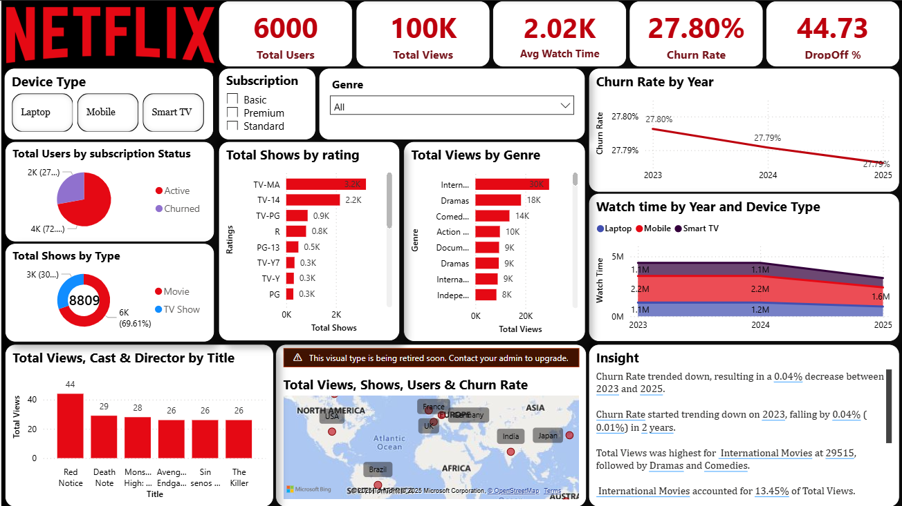
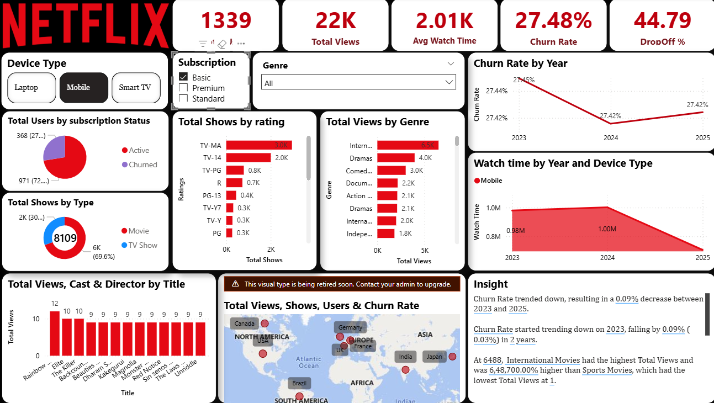
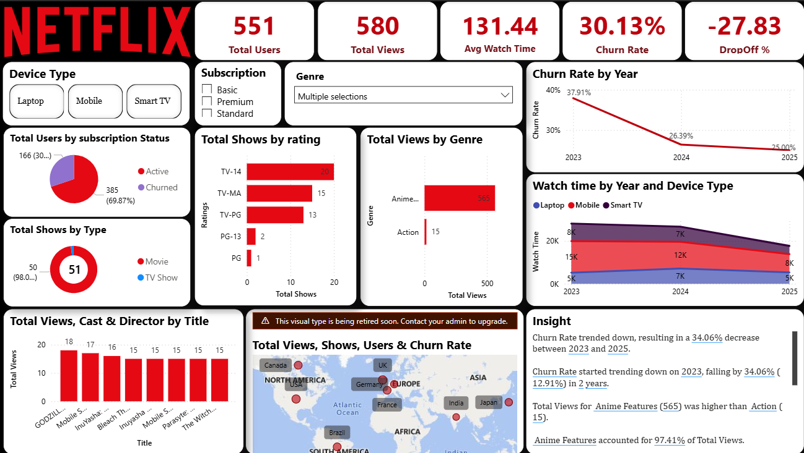

# 🎬 Netflix User Analytics Dashboard

An end-to-end **Power BI project** analyzing Netflix user activity and show metadata to surface insights on **viewership trends, churn risk, and recommendations**.  

---

## 📌 Project Overview

OTT platforms like Netflix rely on analytics to understand **what users watch, on which devices, and why they churn**.  
This project combines **Netflix title metadata** with **synthetic user activity** to build a rich dashboard that answers:

- What are users watching the most?  
- Which subscription tier has the highest churn?  
- How does device usage impact engagement?  
- Which shows should be recommended to different user clusters?  

---

## 📂 Repository Structure
```
├── data/
│ ├── netflix_titles.csv # Netflix show/movie metadata
│ ├── user_activity_dataset.csv # Synthetic user activity dataset
│
├── Netflix_Logo_RGB.png # Logo used in visuals
├── netflix.pbix # Power BI dashboard file
├── README.md # Project documentation
├── Screenshot_1.png # Dashboard screenshot
├── Screenshot_2.png
├── Screenshot_3.png
```

---

## ⚙️ How to Use

1. **Open in Power BI Desktop**  
   - Download this repo.  
   - Open `netflix.pbix` in Power BI Desktop.  
   - Ensure `data/netflix_titles.csv` and `data/user_activity_dataset.csv` are accessible.  

2. **Explore Dashboard Pages**  
   - **Overview:** KPIs, top genres, churn trend.  
   - **Device Analysis:** Engagement by device (Mobile, Laptop, TV, Tablet).  
   - **Subscription Insights:** Churn by subscription tier.  
   - **Clustering & Recommendations:** Suggested shows by user segments.  

---

## 📊 Key Insights

1. **Movies dominate** viewership (~70%) compared to TV shows (~30%).  
2. **Mobile usage is highest**, but laptop usage is growing.  
3. **Basic plan has the highest churn** (~28.3%).  
4. **Churn risk is stabilizing overall**, but device usage patterns shift.  
5. **Top shows attract heavy views**, yet ~45% of users drop off early.  
6. **Regional trends** highlight the US, India, and UK as top markets.  

---

## 📸 Screenshots

### Overall Dashboard


### Device Insights


### Subscription & Churn


---

## 🛠 Tools & Tech

- **Power BI** – dashboarding & storytelling  
- **Python (pandas, sklearn)** – synthetic data generation & clustering  
- **CSV datasets** – Netflix metadata & user activity  

---

## 📜 Notes

- User activity data is **synthetic**, generated for demo purposes.  
- `.pbix` is fully functional — open it directly in Power BI to explore.  

---

## 👤 Author

**Aditya Kumar Yadav**  
📧 [adityadav757@gmail.com]
🌐 [https://portfolio-l9rj.vercel.app/]

