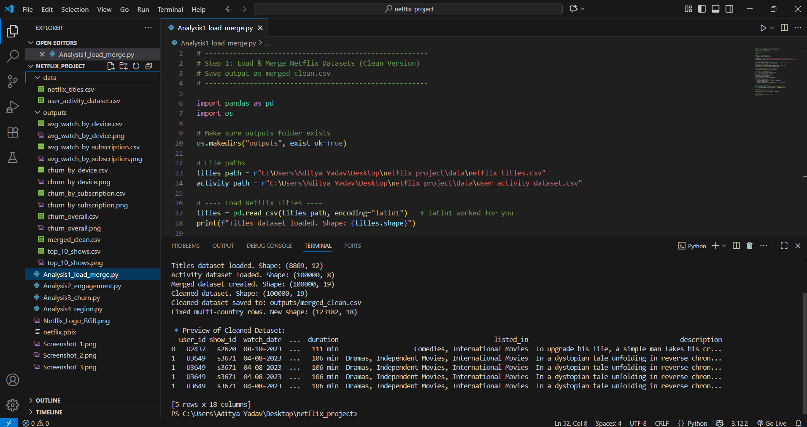
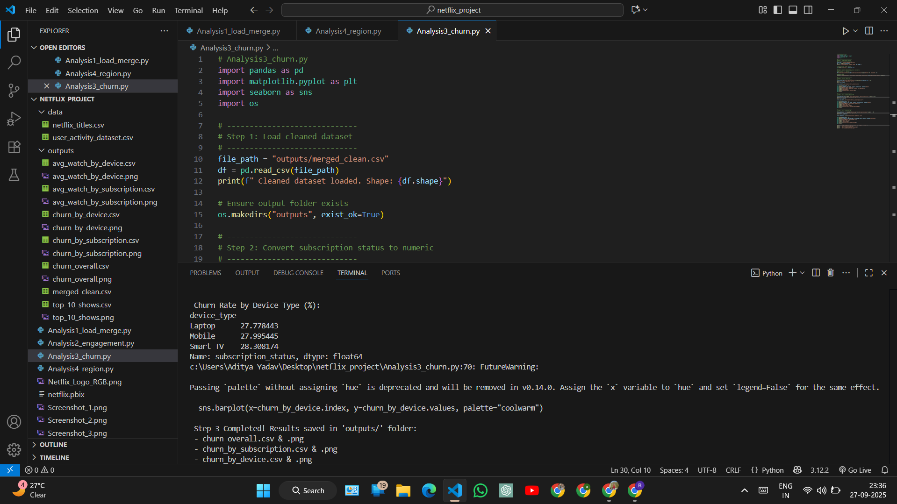
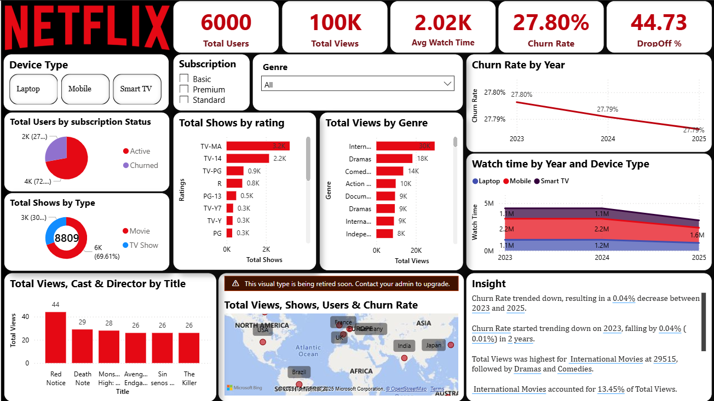
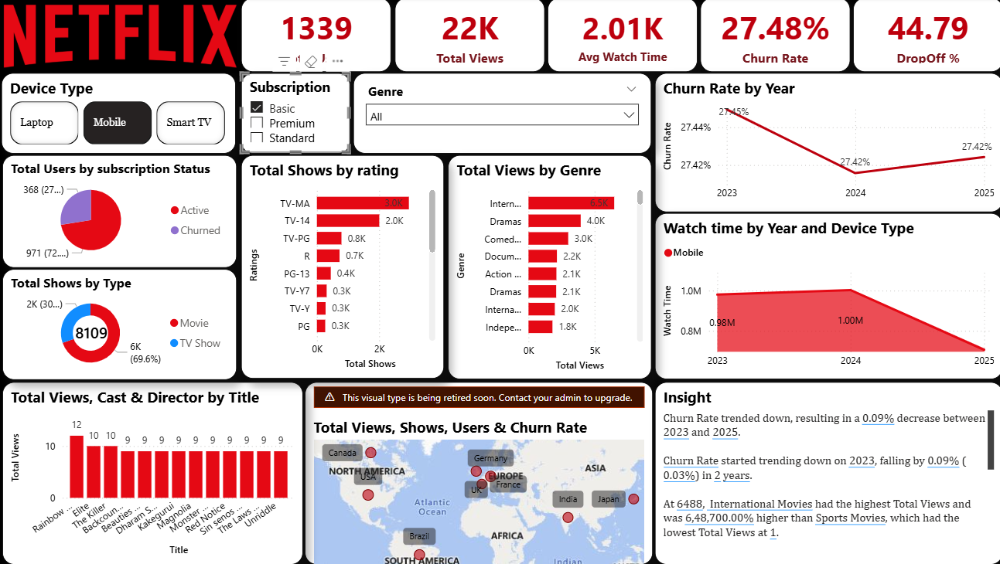

# 🎬 Netflix User Analytics Dashboard

An end-to-end **Data Analytics project** combining **Python** (for data cleaning & analysis) and **Power BI** (for dashboarding) to uncover insights about **Netflix user engagement, churn patterns, and content performance**.  

---

## 📌 Project Overview

OTT platforms like Netflix rely heavily on data to improve **user experience, retention, and recommendations**.  
This project leverages Netflix metadata and synthetic user activity to answer:

- 📺 What type of content do users watch most (Movies vs TV Shows)?  
- 📊 Which subscription plan faces the **highest churn**?  
- 📱 How does device usage (Mobile, Laptop, TV) impact engagement?  
- 🎯 Which genres and titles should Netflix invest in for maximum ROI?  

---

## 📂 Repository Structure

```
├── PythonAnalysis/
│ ├── Analysis1_load_merge.py # Data loading & merging
│ ├── Analysis2_engagement.py # Engagement analysis
│ ├── Analysis3_churn.py # Churn analysis
│ ├── Analysis4_region.py # Regional insights
│
├── ScreenShorts/
│ ├── Netflix_Logo_RGB.png
│ ├── Screenshot_1_cleaning_python.png
│ ├── Screenshot_2_churn_python.png
│ ├── Screenshot_3_powerBi_overview.png
│ ├── Screenshot_4_powerBi_Mobile_Basic.png
│ ├── Screenshot_5_powerBi_International_Genre.png
│ ├── Screenshot_6_powerBi_ModelView.png
│
├── data/
│ ├── netflix_titles.csv # Netflix metadata
│ ├── user_activity_dataset.csv # Synthetic user activity
│
├── outputs/
│ ├── avg_watch_by_device.csv / .png
│ ├── avg_watch_by_subscription.csv / .png
│ ├── churn_by_device.csv / .png
│ ├── churn_by_subscription.csv / .png
│ ├── churn_overall.csv / .png
│
├── netflix.pbix # Power BI Dashboard
├── README.md # Documentation
```

---

## ⚙️ Workflow

1. **Python (Data Cleaning & Analysis)**  
   - Cleaned and merged datasets.  
   - Performed **engagement**, **churn**, and **regional** analysis.  
   - Exported results into CSV & PNG (`outputs/`).  

2. **Power BI (Visualization & Storytelling)**  
   - Connected processed datasets into Power BI.  
   - Created interactive dashboards with KPIs, churn trends, device usage, and subscription insights.  
   - Built a **data model** linking 4 tables (`netflix_titles`, `user_activity_dataset`, `User_status_type`, `Show_Genre`).  

3. **Insights & Recommendations**  
   - Derived **business insights** from dashboards.  
   - Suggested strategies for **reducing churn and boosting engagement**.  

---

## 📊 Key Insights

1. **Movies dominate** with ~70% of total content views.  
2. **Mobile devices lead engagement**, but laptop usage is increasing.  
3. **Basic plan churn is highest** (~28.3%).  
4. **International Movies** had the highest total views (29,515).  
5. Around **45% of users drop off early**, signaling a need for **better retention strategies**.  
6. **Top markets**: USA, India, and UK show the strongest engagement.  

---

## 📸 Screenshots

### Python Analysis – Data Cleaning & Churn
  
  

### Power BI Dashboard – Overview
  

### Device & Subscription Insights
  

### Genre & Regional Trends


### Power BI Model View - Data Model
  

---

## 🛠 Tools & Technologies

- **Python** → pandas, matplotlib, scikit-learn (for churn model & clustering)  
- **Power BI** → Dashboarding, Data Modeling, Storytelling  
- **CSV Datasets** → Netflix metadata & synthetic user activity  

---

## 🚀 Recommendations for Netflix

Based on the analysis & dashboard:  
1. **Focus on International & Drama content**, as they have the highest engagement.  
2. **Address churn in Basic Plan** through improved benefits or upsell strategies.  
3. **Enhance mobile experience** since it’s the most-used device for streaming.  

---

## 📜 Notes

- Data is **synthetic** (generated for learning & demo).  
- Dashboard (`netflix.pbix`) is fully functional and can be opened directly in Power BI.  

---

## 🔗 Links

- 📊 **Live Dashboard (Microsoft Fabric)** → [Click Here](https://app.fabric.microsoft.com/view?r=eyJrIjoiM2E3YTI5YTAtYzRmMy00NmU5LTgxZmMtNjBkNjc4OTA5YzYxIiwidCI6ImUxNGU3M2ViLTUyNTEtNDM4OC04ZDY3LThmOWYyZTJkNWE0NiIsImMiOjEwfQ%3D%3D)  
- 💻 **Gmail** → [Aditya’s Gmail](adityadav757@gmail.com)  
- 🌐 **Portfolio** → [Aditya’s Portfolio](https://portfolio-l9rj.vercel.app/)  

---

## 📝 Summary

1. **Python for Cleaning & Analysis** → Engagement, churn, and regional patterns analyzed.  
2. **Power BI for Dashboarding** → Built an interactive dashboard with 6 key pages.  
3. **Business Insights** → Recommendations provided to reduce churn & improve engagement.  
